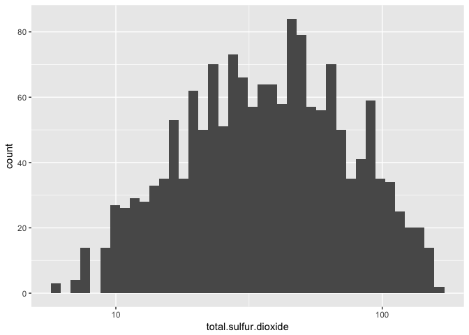
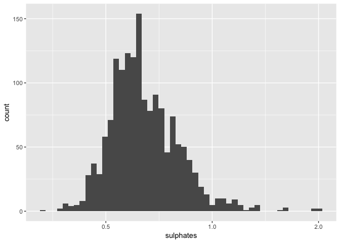

---
output:
  html_document:
    css: style.css
    keep_md: true 
---

# The Secret to Good Red Wine


<p>The dataset contains red wines with the chemical properties of the wine. 
At least 3 wine experts rated the quality of each wine, providing a rating 
between 0 (very bad) and 10 (very excellent).</p>

<p>Input variables (based on physicochemical tests):<br>
   1 - fixed acidity (tartaric acid - g / dm^3)<br>
   2 - volatile acidity (acetic acid - g / dm^3)<br>
   3 - citric acid (g / dm^3)<br>
   4 - residual sugar (g / dm^3)<br>
   5 - chlorides (sodium chloride - g / dm^3<br>
   6 - free sulfur dioxide (mg / dm^3)<br>
   7 - total sulfur dioxide (mg / dm^3)<br>
   8 - density (g / cm^3)<br>
   9 - pH<br>
   10 - sulphates (potassium sulphate - g / dm3)<br>
   11 - alcohol (% by volume)<br>
   Output variable (based on sensory data): <br>
   12 - quality (score between 0 and 10)</p>

## Univariate Plots Section

### Structure and summary of the data


```
## 'data.frame':	1599 obs. of  13 variables:
##  $ X                   : int  1 2 3 4 5 6 7 8 9 10 ...
##  $ fixed.acidity       : num  7.4 7.8 7.8 11.2 7.4 7.4 7.9 7.3 7.8 7.5 ...
##  $ volatile.acidity    : num  0.7 0.88 0.76 0.28 0.7 0.66 0.6 0.65 0.58 0.5 ...
##  $ citric.acid         : num  0 0 0.04 0.56 0 0 0.06 0 0.02 0.36 ...
##  $ residual.sugar      : num  1.9 2.6 2.3 1.9 1.9 1.8 1.6 1.2 2 6.1 ...
##  $ chlorides           : num  0.076 0.098 0.092 0.075 0.076 0.075 0.069 0.065 0.073 0.071 ...
##  $ free.sulfur.dioxide : num  11 25 15 17 11 13 15 15 9 17 ...
##  $ total.sulfur.dioxide: num  34 67 54 60 34 40 59 21 18 102 ...
##  $ density             : num  0.998 0.997 0.997 0.998 0.998 ...
##  $ pH                  : num  3.51 3.2 3.26 3.16 3.51 3.51 3.3 3.39 3.36 3.35 ...
##  $ sulphates           : num  0.56 0.68 0.65 0.58 0.56 0.56 0.46 0.47 0.57 0.8 ...
##  $ alcohol             : num  9.4 9.8 9.8 9.8 9.4 9.4 9.4 10 9.5 10.5 ...
##  $ quality             : int  5 5 5 6 5 5 5 7 7 5 ...
```


```
##        X          fixed.acidity   volatile.acidity  citric.acid   
##  Min.   :   1.0   Min.   : 4.60   Min.   :0.1200   Min.   :0.000  
##  1st Qu.: 400.5   1st Qu.: 7.10   1st Qu.:0.3900   1st Qu.:0.090  
##  Median : 800.0   Median : 7.90   Median :0.5200   Median :0.260  
##  Mean   : 800.0   Mean   : 8.32   Mean   :0.5278   Mean   :0.271  
##  3rd Qu.:1199.5   3rd Qu.: 9.20   3rd Qu.:0.6400   3rd Qu.:0.420  
##  Max.   :1599.0   Max.   :15.90   Max.   :1.5800   Max.   :1.000  
##  residual.sugar     chlorides       free.sulfur.dioxide
##  Min.   : 0.900   Min.   :0.01200   Min.   : 1.00      
##  1st Qu.: 1.900   1st Qu.:0.07000   1st Qu.: 7.00      
##  Median : 2.200   Median :0.07900   Median :14.00      
##  Mean   : 2.539   Mean   :0.08747   Mean   :15.87      
##  3rd Qu.: 2.600   3rd Qu.:0.09000   3rd Qu.:21.00      
##  Max.   :15.500   Max.   :0.61100   Max.   :72.00      
##  total.sulfur.dioxide    density             pH          sulphates     
##  Min.   :  6.00       Min.   :0.9901   Min.   :2.740   Min.   :0.3300  
##  1st Qu.: 22.00       1st Qu.:0.9956   1st Qu.:3.210   1st Qu.:0.5500  
##  Median : 38.00       Median :0.9968   Median :3.310   Median :0.6200  
##  Mean   : 46.47       Mean   :0.9967   Mean   :3.311   Mean   :0.6581  
##  3rd Qu.: 62.00       3rd Qu.:0.9978   3rd Qu.:3.400   3rd Qu.:0.7300  
##  Max.   :289.00       Max.   :1.0037   Max.   :4.010   Max.   :2.0000  
##     alcohol         quality     
##  Min.   : 8.40   Min.   :3.000  
##  1st Qu.: 9.50   1st Qu.:5.000  
##  Median :10.20   Median :6.000  
##  Mean   :10.42   Mean   :5.636  
##  3rd Qu.:11.10   3rd Qu.:6.000  
##  Max.   :14.90   Max.   :8.000
```


```
## [1] 0
```

<p>This data consists 1599 observations and 13 columns, and with the 1st column 
being an index, there are 12 variables. No missing value was found.</p>

#### Distribution: Fixed Acidity
<p class="box"><b>Fixed Acidity</b>: most acids involved with wine or fixed or 
nonvolatile (do not evaporate readily)</p>

<!-- -->


```
##    Min. 1st Qu.  Median    Mean 3rd Qu.    Max. 
##    4.60    7.10    7.90    8.32    9.20   15.90
```

<p>Distribution of fixed acidity is slightly right-skewed, and its peak marks 
around 7 and 8. It contains many outliers, creating a huge gap between the 3rd 
quartile(9.20) and max number(15.90) compread to the difference between the 
minimum number(4.60) and the 1st quartile(7.10).</p> 

#### Distribution: Volatile Acidity
<p class="box"><b>Volatile Acidity</b>: the amount of acetic acid in wine, which 
at too high of levels can lead to an unpleasant, vinegar taste</p>

<!-- -->


```
##    Min. 1st Qu.  Median    Mean 3rd Qu.    Max. 
##  0.1200  0.3900  0.5200  0.5278  0.6400  1.5800
```

<p>Right skewed distribution. I also see a few outliers. Let's investigate the 
furthest outlier.</p> 


```
##      X fixed.acidity volatile.acidity citric.acid residual.sugar chlorides
## 1 1300           7.6             1.58           0            2.1     0.137
##   free.sulfur.dioxide total.sulfur.dioxide density  pH sulphates alcohol
## 1                   5                    9 0.99476 3.5       0.4    10.9
##   quality
## 1       3
```

<p>It doesn't look like I need to remove it for now, but I also see that the 
quality is scored "3", which is the worst in this dataset and backs up the 
description of this attribute.</p>

#### Distribution: Citric Acid
<p class="box"><b>Citric Acid</b>: found in small quantities, citric acid can 
add 'freshness' and flavor to wines</p>

<!-- -->


```
##    Min. 1st Qu.  Median    Mean 3rd Qu.    Max. 
##   0.000   0.090   0.260   0.271   0.420   1.000
```

<p>This is far from normal distribution. The highest peak is actually at 0, 
and the second highest at 0.5. I wonder what that outlier looks like:</p>


```
##     X fixed.acidity volatile.acidity citric.acid residual.sugar chlorides
## 1 152           9.2             0.52           1            3.4      0.61
##   free.sulfur.dioxide total.sulfur.dioxide density   pH sulphates alcohol
## 1                  32                   69  0.9996 2.74         2     9.4
##   quality
## 1       4
```

<p>It doesn't seem like that high level of this attribute contributes to the 
quality of wine.</p>

#### Distribution: Residual Sugar
<p class="box"><b>Residual Sugar</b>: the amount of sugar remaining after 
fermentation stops, it's rare to find wines with less than 1 gram/liter and 
wines with greater than 45 grams/liter are considered sweet</p>

<!-- -->


```
##    Min. 1st Qu.  Median    Mean 3rd Qu.    Max. 
##   0.900   1.900   2.200   2.539   2.600  15.500
```

<p>So many outliers and heavely skewed. The majority is distributed around 1.9 
to 2.6, and the tail of outliers goes out far away till 15.5. What does it look 
like if I removed all the extremes? I'll plot a distribution of IQR.</p>

<!-- -->
<p>This tells me the differnce in the IQR is pretty moderate, except that I see 
alarmingly low count in numbers in 2 decimal places (i.g. 2.05, 2.15 etc.). 
What makes the low ones exceptionally low? I also want to see what happens when 
I log-transform the original histogram:</p>

<!-- -->

```
##     Min.  1st Qu.   Median     Mean  3rd Qu.     Max. 
## -0.04576  0.27875  0.34242  0.36925  0.41497  1.19033
```

<p>This looks much better, though it still has a long tail on the right side.</p>

#### Distribution: Chlorides
<p class="box"><b>Chlorides</b>: the amount of salt in the wine</p>

<!-- -->


```
##    Min. 1st Qu.  Median    Mean 3rd Qu.    Max. 
## 0.01200 0.07000 0.07900 0.08747 0.09000 0.61100
```

<p>Again, many outliers. Here's what happens when I log-transform the 
histogram.</p>

<!-- -->

<p>Looks more normal, and the majority are around 0.075 to 0.1.</p>

#### Distribution: Free Sulfur Dioxide
<p class="box"><b>Free Sulfur Dioxide</b>: the free form of SO2 exists in 
equilibrium between molecular SO2 (as a dissolved gas) and bisulfite ion; it 
prevents microbial growth and the oxidation of wine</p>

<!-- -->


```
##    Min. 1st Qu.  Median    Mean 3rd Qu.    Max. 
##    1.00    7.00   14.00   15.87   21.00   72.00
```

<p>Right skewed distribution with many outliers.</p>

#### Distribution: Total Sulfur Dioxide
<p class="box"><b>Total Sulfur Dioxide</b>: amount of free and bound forms of 
S02; in low concentrations, SO2 is mostly undetectable in wine, but at free SO2 
concentrations over 50 ppm, SO2 becomes evident in the nose and taste of wine</p>

<!-- -->


```
##    Min. 1st Qu.  Median    Mean 3rd Qu.    Max. 
##    6.00   22.00   38.00   46.47   62.00  289.00
```

<p>Heavely skewed again, and there are extreme outliers. If I take out those two 
outliers:</p>

<!-- -->

<p>When I look at the distribution in log10 scale:</p>

<!-- -->

<p>This is closer to a normal distribution, with the highest count around 40.</p>

#### Distribution: Density
<p class="box"><b>Density</b>: the density of water is close to that of water 
depending on the percent alcohol and sugar content</p>

<!-- -->


```
##    Min. 1st Qu.  Median    Mean 3rd Qu.    Max. 
##  0.9901  0.9956  0.9968  0.9967  0.9978  1.0037
```

<p>This is a better looking distribution. Median 0.9968 and Mean 0.9967 so close 
to gether, this is almost a normal distribution.</p>

#### Distribution: pH
<p class="box"><b>pH</b>: describes how acidic or basic a wine is on a scale 
from 0 (very acidic) to 14 (very basic); most wines are between 3-4 on the pH 
scale</p>

<!-- -->


```
##    Min. 1st Qu.  Median    Mean 3rd Qu.    Max. 
##   2.740   3.210   3.310   3.311   3.400   4.010
```

<p>Another good looking distribution that is close to normal. Outliers on both 
end that I can possible take out. </p>

#### Distribution: Sulphates
<p class="box"><b>Sulphates</b>: a wine additive which can contribute to sulfur 
dioxide gas (S02) levels, wich acts as an antimicrobial and antioxidant</p>

<!-- -->


```
##    Min. 1st Qu.  Median    Mean 3rd Qu.    Max. 
##  0.3300  0.5500  0.6200  0.6581  0.7300  2.0000
```

<p>When I log-scale it:</p>

<!-- -->

<p>Median stands out in the distribution and gradually decreases to 1, and after 
that is a long tail of outliers.</p>

#### Distribution: Alcohol
<p class="box"><b>Alcohol</b>: the percent alcohol content of the wine</p>

<!-- -->


```
##    Min. 1st Qu.  Median    Mean 3rd Qu.    Max. 
##    8.40    9.50   10.20   10.42   11.10   14.90
```

<p>The count decreases as the level of alcohol increases. The peak is between 
9 and 10.</p>

#### Distribution: Quality
<p class="box"><b>Quality</b>: score between 0 and 10</p>

<!-- -->


```
##    Min. 1st Qu.  Median    Mean 3rd Qu.    Max. 
##   3.000   5.000   6.000   5.636   6.000   8.000
```

<p>I can see that the majority of wine were scored between 5 and 6. No wines 
were below 3 or above 8.</p>

#### Distribution: Low and High Quality

<!-- -->

<p>When I exclude the quality 5 and 6, and combined the 3 and 4 into a class 
called "poor" and 7 and 8 into a class "excellent", I see most were rated high 
than low.</p>

## Univariate Analysis

<p class="question">What is the structure of your dataset?</p>
<p class="answer">The dataset has 13 columns and 1599 rows, and has 12 variables. 
1 categorical variable, which is "quality", and the rest are continuous 
numerical variables.The quality scores go from 0 (lowest) to 10 (highest). Most 
wines score between 5 and 6, and few are labels as excellent or poor.</p>

<p class="question">What is/are the main feature(s) of interest in your 
dataset?</p>
<p class="answer">The main feature of interest would be attributes that are 
directly correlated to the quality of wines. Attributes such as volatile 
acidity would have quite direct influence. For example, volatile acidity too 
high of levels can lead to an unpleasant, and 
<a href="http://waterhouse.ucdavis.edu/whats-in-wine/fixed-acidity">Waterhouse 
Lab</a> explains that acids impart the sourness or tartness that is a fundamental 
feature in wine taste.</p> 

<p class="question">What other features in the dataset do you think will help 
support your investigation into your feature(s) of interest?</p>
<p class="answer">Finding combinations of attributes that make good wine.</p>

<p class="question">Did you create any new variables from existing variables in 
the dataset?</p>
<p class="answer">Not at this time, but I would as needed in the process.</p>

<p class="question">Of the features you investigated, were there any unusual 
distributions? Did you perform any operations on the data to tidy, adjust, or 
change the form of the data? If so, why did you do this?</p>
<p class="answer">On residual sugar plot, I set the x limit within IQR to take a 
closer look at the majority, because it was heavily right skewed and there were 
so many outliers. I then log-tranformed it to look at the original plot again to 
better look at the tail of the distribution. The same process was applied to 
total sulfur dioxide. I also log-transformed the chlorides and sulphates plots 
to since their right skewed distributions had quite wide ranges.</p>

## Bivariate Plots Section


### Comparison of Quality by Attributes
Before getting into each plot, I'm going to take a look at the whole dataset 
for over-all comparison.

<!-- -->

<p>From this comparison, the attributes that may positively affect the 
quality of wine are volatile acidity, citric acid, density, pH, sulphates, and 
alcohol.</p>

#### Focusing on the Extremes
<p>Because most of the wines were rated 5 and 6, it's a little hard to see which 
attributes make "poor" and "excellent" wines. I'm going to subset the data so I 
can focus on those extreme cases.</p>

<!-- -->
<p>This is much easier to see the difference in the quality. I'm going to check 
the rest of attributes.</p>

<!-- -->

<p>With this plot, I can see the bigger quality distinctions are observed 
with:<br>
- alcohol (excellent wines have higher alcohol)<br>
- volatile acidity (excellent wines have lower volatile acidity)<br>
- citric acidity (excellent wines have higher citric acid)<br>
- sulphates (excellent wines have higher sulphates)</p>

#### Correlation Plot
<p>First running on the original dataset, then comparing it with the one without 
the "normal" wines.</p>
<!-- -->
<p>The first one on the left confirms my observation on alcohol with its 
stronger correlation with quality. The second on on the right also confirms my 
observation on the boxplots comparison where alcohol, volatile acidity, citric 
acid, and sulphates made difference in extremes. Some numbers of attributes with 
each other also changed, and when they did, most of the correlation became 
stronger.</p>


## Bivariate Analysis

<p class="question">Talk about some of the relationships you observed in this 
part of the investigation. How did the feature(s) of interest vary with other 
features in the dataset?</p>
<p class="answer">First, I investigated the relationship of quality and each 
attribute, but the initial plot that displays all observations showed  that the 
only attribute with a decent correlation was alcohol — the quality seems to go 
up as the alcohol level did as well. The boxplot confirmed that the median and 
mean did indeed went up as the quality did, but only from score 5 to 8. The 
correlation test confirmed it was approximately 0.48. But when I removed the 
wines scored 5 and 6 from the plot to focus on the ones scored below 5 and above 
6, I found there were more attributes that produced noteworthy difference in 
quality.</p>

<p class="question">Did you observe any interesting relationships between the 
other features (not the main feature(s) of interest)?</p>
<p class="answer">The relationships with other attributes besides the quality. 
Some had stronger correlations with each other than with the quality, and I 
wonder if that indicates the attributes' influence on each other and that's what 
determines the quality of wine. They also got stronger when I used a subset 
without the ones scored 5 and 6.</p>

<p class="question">What was the strongest relationship you found?</p>
<p class="answer">The ones with stronger correlations from the original dataset
(-0.7 > and 0.7 <):<br>
- pH and fixed acidity<br>
- density and fixed acidity <br>
- total sulfur dioxide and free fulfur dioxide<br>
- citric acid and fixed acidity</p>

## Multivariate Plots Section

First, I'm going to compare alcohol with density by excellent and poor wines. 
At this point, since my main interest is finding out what makes these distinct 
wines, I'll exclude the quality 5 and 6 from these plots.</p>

#### Density and Alcohol by Quality

<!-- -->

```
## 
## 	Pearson's product-moment correlation
## 
## data:  no.normal$density and no.normal$alcohol
## t = -10.925, df = 278, p-value < 2.2e-16
## alternative hypothesis: true correlation is not equal to 0
## 95 percent confidence interval:
##  -0.6251305 -0.4604302
## sample estimates:
##       cor 
## -0.548071
```

<p>Density has the strongest correlation with alcohol, and the combination shows 
a clear seperation between the two quality groups. Now I'm going to compare the 
four pairs with the strongest correlations.<br>
- pH and fixed acidity<br>
- density and fixed acidity <br>
- total sulfur dioxide and free fulfur dioxide<br>
- citric acid and fixed acidity</p>

#### pH and Fixed Acidity

<!-- -->

```
## 
## 	Pearson's product-moment correlation
## 
## data:  no.normal$pH and no.normal$fixed.acidity
## t = -19.005, df = 278, p-value < 2.2e-16
## alternative hypothesis: true correlation is not equal to 0
## 95 percent confidence interval:
##  -0.7985685 -0.6958055
## sample estimates:
##        cor 
## -0.7517146
```

<p>They have a pretty strong correlation with each other, but that doesn't seem 
to directly affect on the quality.</p>

#### Density and Fixed Acidity
<!-- -->


```
## 
## 	Pearson's product-moment correlation
## 
## data:  no.normal$density and no.normal$fixed.acidity
## t = 17.476, df = 278, p-value < 2.2e-16
## alternative hypothesis: true correlation is not equal to 0
## 95 percent confidence interval:
##  0.6624851 0.7750110
## sample estimates:
##       cor 
## 0.7235198
```
<p>Here is another strong, correlation, and the seperation of the two quality 
groups is more apparent.</p>

#### Total Sulfur Dioxide and Free Sulfur Dioxide

<!-- -->


```
## 
## 	Pearson's product-moment correlation
## 
## data:  no.normal$total.sulfur.dioxide and no.normal$free.sulfur.dioxide
## t = 14.286, df = 278, p-value < 2.2e-16
## alternative hypothesis: true correlation is not equal to 0
## 95 percent confidence interval:
##  0.5774698 0.7134541
## sample estimates:
##       cor 
## 0.6506477
```
<p>If I excluded the two outliers on the right:</p>

<!-- -->

<p>Most are concentrated towads 0, but as the points spread out more, the 
levels on both attributes increase. In this relationship, however, I don't see 
anything significant that are correlated to quality.</p>

#### Citric Acid and Fixed Acidity

<!-- -->


```
## 
## 	Pearson's product-moment correlation
## 
## data:  no.normal$citric.acid and no.normal$fixed.acidity
## t = 17.565, df = 278, p-value < 2.2e-16
## alternative hypothesis: true correlation is not equal to 0
## 95 percent confidence interval:
##  0.6645529 0.7764821
## sample estimates:
##       cor 
## 0.7252755
```

<p>And if I excluded outliers on both axis:</p>

<!-- -->

<p>Citric acid and fixed acidity have a strong correlation of 0.73. Although the 
line shows weak seperation of the quality groups, the poor group seems to be 
concentrated on fixed acidity level 6-9 and citric acid level 0 to 0.125., while 
the excellent group is concentrated in the middle of the plot.</p>

## Multivariate Analysis

<p class="question">Talk about some of the relationships you observed in this 
part of the investigation. Were there features that strengthened each other in 
terms of looking at your feature(s) of interest?</p>
<p class="answer">From the previous analysis, I found that alcohol had the 
strongest correlation with quality, so I wanted to choose an attribute that had 
the strongest correlation with alcohol, and run their relationship by quality. 
The plot had a good seperation between excellent and poor wines. I also checked 
where these quality groups were in each attributes pairs that had the strongest 
correlations, and density and fixed acidity also had a strong correlation with 
quality. </p>

<p class="question">Were there any interesting or surprising interactions 
between features?</p>
<p class="answer">It was interesting to see that some pairs would have a strong 
correlation with each other, but that doesn't always contribute to quality. 
This investigation has become a lot more complex and difficult than I 
expected.</p>


## Final Plots and Summary

<p class="question">Plot One</p>

<!-- -->

<p>In the range of 0 to 10, most of the wines in this dataset were rated as 
"normal", between 5 and 6. This was important to be noted in order to determine 
the direction of the later analysis. When focusing on the overall observations, 
it became difficult to find any direct correlation with the quality because most 
wines were "normal". When I pinpointed my focus on the "non-normal" wines, I was 
able to find some interesting facts.</p>

<p class="question">Plot Two</p>

<!-- -->

<p>Out of all the attributes, alcohol has the strong correlation with quality.
When I removed ones with their quality 5 and 6, which were the majority of 
distribution, the attribute correlations became stronger with quality. Above 
shows the attributes with the strongest correlation.</p>

<p class="question">Plot Three</p>

<!-- -->

<p>When looking at the quality, the strong correlations were observed between 
density and alcohol, and density and fixed acidity. The lower the alcohol level, 
the higher the density is, while the wines with higher alcohol level tend to be 
better in quality. The higher the density, the higher the fixed acidity, while 
the wines with higher fixed acidity tend to be better in quality.</p>


## Reflection

<p>When I first chose this detaset, I had an assumption that these attributes 
would somehow have direct influence on wine quality. However, all the 
correlation were weak to moderate, and the strongest correlation was with 
alcohol. The distribution showed that most wines were rated 5 and 6, and in 
order to see the better difference in what makes wines good and bad, I've 
removed those two qualities from the dataset and compared the highest and lowest 
ones. Only then I saw which attributes were correlated with bigger difference 
between the "excellent" and "poor". Attributes that had strong correlations with 
excellent wine was:<br><br>
- Higher alcohol<br>
- Lower volatile acidity<br>
- Higher citric acid <br>
- Higher sulphates</p>

<p>I then decided to investigate relationships of attributes, and I saw much 
stronger correlation in them. In the corelation plot, the ones with the 
strongest correlations were:<br><br>
- pH and fixed acidity<br>
- Density and fixed acidity <br>
- Total sulfur dioxide and free fulfur dioxide<br>
- Citric acid and fixed acidity</p>

<p>When compared with the quality, ones with density had the strongest 
correlation. This is understandable since it's influenced by the percent alcohol 
and sugar content. The trend in their relationships are:<br><br>
- The lower the alcohol level, the higher the density is, while the wines with 
higher alcohol level tend to be better in quality.<br>
- The higher the density, the higher the fixed acidity, while the wines with 
higher fixed acidity tend to be better in quality.</p>

<p>The issue became more and more evident as I moved along in the process. The 
quality judged by people are not absolute, however experts they are in the field. 
And flavors of wine are so complex and interwined with each attribute that it is 
very difficult to determin what exactly makes good or bad wine. But perhaps with 
more observations, it would become more possible to make predictions.</p> 

<p>Source: 
https://github.com/hadley/ggplot2/wiki/Share-a-legend-between-two-ggplot2-graphs</p>
